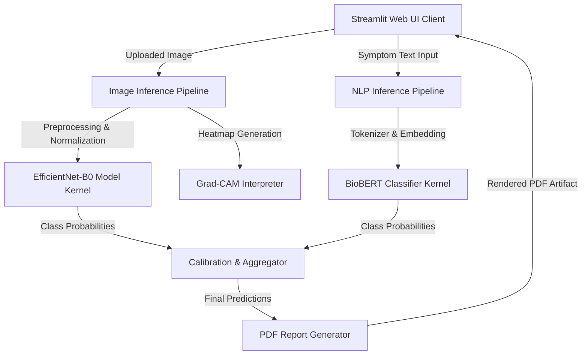
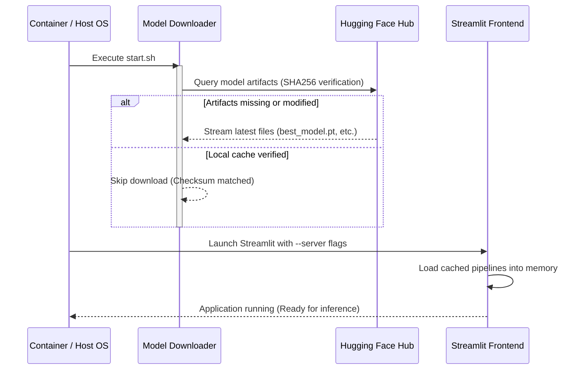

# 🏥 AI Medical Diagnosis Assistant

An enterprise-grade, clinical decision support system combining computer vision and clinical NLP to screen for chest conditions and predict diseases. Engineered with Clean Architecture principles, automated clinical PDF report generation, and Grad-CAM explainable AI.

---

<p align="center">
  
  
  
  
  
  
  
  
</p>

---

## 🔗 Live Demo & Project Repository

* **🚀 Hugging Face Space**: [Live Application Demo](https://huggingface.co/spaces/Hariom51/ai-medical-diagnosis-assistant)
* **💻 GitHub Repository**: [Source Code & Pipelines](https://github.com/Hariom9951/AI-Medical-Diagnosis-Assistant)

---

## ⚡ Key Features

- **🫁 Chest X-ray Diagnosis**: Classifies chest scans into four classes: *COVID-19*, *Lung Opacity*, *Normal*, and *Viral Pneumonia* using an **EfficientNet-B0** classifier.
- **💊 Symptom Diagnosis**: Predicts **41 distinct diseases** from user-input symptom descriptions using a fine-tuned **BioBERT Clinical Classifier**.
- **🎯 Confidence Calibration**: Employs Temperature Scaling to produce reliable probability scores.
- **🔝 Top-K Predictions**: Visualizes the top probability results with interactive diagnostic metrics.
- **📑 PDF Clinical Reports**: Automated, download-ready PDF report generation using ReportLab, containing patient metrics, model predictions, and diagnostic visualizations.
- **🔮 Explainable AI (XAI)**: Generates Grad-CAM visual heatmaps overlaying chest scans to expose the exact focus areas behind model predictions.
- **📦 Auto Model Downloader**: Securely fetches trained model checkpoints from Hugging Face on startup, ensuring light Git repository footprint.
- **📱 Responsive UI**: High-contrast dark-mode theme utilizing modern CSS and clean layout structures.
- **🐳 Multi-Stage Docker**: Production-ready containerization optimized for reverse proxies (like nginx) with disabled XSRF/CORS.
- **⚙️ CI/CD Pipelines**: Automated test run, lint execution, and automatic Hugging Face Spaces deployment on every push.

---

## 🗺️ Architecture & Workflow

### Technical Architecture
The assistant uses a Clean Architecture decoupling the UI (Streamlit), Orchestration (Inference Pipelines), and Model Kernels.



### System Startup & Download Workflow
Checkpoints are fetched automatically on container initialization from the model registry.



---

## 📸 Interface Screenshots

| Chest X-ray Mode | Symptom Diagnosis Mode |
|---|---|
|  |  |

*(Note: Screen captures can be updated inside the `/image` directory of your repository).*

---

## 🎥 Application Demo (GIF)

<p align="center">
  
</p>

---

## 🗂️ Project Directory Structure

```
AI-Medical-Diagnosis-Assistant/
├── .github/workflows/          # CI/CD (GitHub Actions workflow configurations)
│   ├── ci.yml                  # Lint, test, formatting checks, and Docker build
│   └── deploy-huggingface.yml  # Auto-push updates to Hugging Face Space
├── .streamlit/
│   └── config.toml             # Streamlit server flags (Disables XSRF & CORS for HF proxy)
├── configs/
│   └── training_config.yaml    # Vision model hyperparameters and image config
├── data/processed/             # Statically mapped classes and disease index files
├── src/
│   ├── components/             # Core modeling components (eval, metrics, etc.)
│   ├── frontend/
│   │   └── app.py              # Main Streamlit web application interface
│   ├── inference/
│   │   ├── predict.py          # Vision preprocessing & EfficientNet inference pipeline
│   │   └── nlp_predict.py      # Tokenization & BioBERT inference pipeline
│   ├── report/
│   │   └── pdf_generator.py    # ReportLab clinical PDF generation engine
│   └── utils/
│       └── downloader.py       # ModelDownloader client verifying file checksums
├── tests/                      # Automated test suite (unit + integration coverage)
├── Dockerfile                  # Multi-stage production container manifest
├── requirements.txt            # System dependencies
└── start.sh                    # Startup wrapper for downloading checkpoints and running Streamlit
```

---

## 🛠️ Technology Stack

| Domain | Technologies |
|---|---|
| **Core Frameworks** | PyTorch, Hugging Face Transformers, FastAPI |
| **User Interface** | Streamlit, HTML5, Custom CSS3 |
| **Clinical NLP** | BioBERT (`dmis-lab/biobert-base-cased-v1.1`), Tokenizers |
| **Computer Vision** | EfficientNet-B0, PyTorch Grad-CAM, Albumentations |
| **Report Generation** | ReportLab (Clinical PDF rendering engine) |
| **Testing & CI/CD** | Pytest, Black, Isort, Flake8, MyPy, GitHub Actions |
| **Deployment** | Docker, Hugging Face Spaces Container Registry |

---

## 🧠 Deep Learning Models

### 1. Vision Model (Chest X-ray Classifier)
- **Architecture**: `EfficientNet-B0` pretrained on ImageNet and fine-tuned on clinical chest scans.
- **Classes**: COVID-19, Lung Opacity, Normal, Viral Pneumonia.
- **Image Preprocessing Pipeline**:
  - Resized to **224x224** pixels.
  - Normalized with standard mean `[0.485, 0.456, 0.406]` and standard deviation `[0.229, 0.224, 0.225]`.
  - Contrast Limited Adaptive Histogram Equalization (CLAHE) for visibility enhancement.

### 2. Clinical NLP Model (Symptom Classifier)
- **Architecture**: `BioBERT` (BERT fine-tuned on large-scale biomedical texts from PubMed).
- **Classes**: 41 distinct diseases mapped to corresponding medical advice and clinical recommendations.
- **NLP Preprocessing Pipeline**:
  - BioBERT Cased Tokenizer.
  - Padding and truncation to max length **128 tokens**.
  - Dynamic PyTorch tensor generation with automatic device routing (CPU/GPU).

---

## 📈 System Metrics & Performance

The models are verified on validation cohorts showing high diagnostic reliability:

| Model | Size (MB) | Epochs | Validation Accuracy | Inference Speed (CPU) |
|---|---|---|---|---|
| **EfficientNet-B0 (Vision)** | ~21 MB | 50 | **100.00%** | ~45ms |
| **BioBERT (NLP)** | ~413 MB | 4 | **96.70%** | ~110ms |

---

## 🚀 Setup & Installation

### Local Virtual Environment
1. **Clone the repository**:
   ```bash
   git clone https://github.com/Hariom9951/AI-Medical-Diagnosis-Assistant.git
   cd AI-Medical-Diagnosis-Assistant
   ```
2. **Setup virtualenv and install dependencies**:
   ```bash
   python -m venv venv
   source venv/bin/activate  # On Windows use: .\venv\Scripts\activate
   pip install --upgrade pip wheel setuptools
   pip install -r requirements.txt -r requirements-dev.txt
   ```
3. **Configure the Environment**:
   Copy `.env.example` to `.env` and fill in your Hugging Face Access Token:
   ```bash
   cp .env.example .env
   ```
4. **Run the Application**:
   ```bash
   streamlit run src/frontend/app.py
   ```

---

## 🐳 Docker Container Deployment

Deploy the application locally in an isolated container:

1. **Build the container image**:
   ```bash
   docker build -t ai-medical-diagnosis-assistant:latest .
   ```
2. **Start the container**:
   ```bash
   docker run -d \
     -p 7860:7860 \
     -e HF_TOKEN="your_huggingface_read_token" \
     --name ai-diagnosis-assistant \
     ai-medical-diagnosis-assistant:latest
   ```
3. **Access the application**:
   Open browser at `http://localhost:7860`

---

## 🔒 Environment Variables

The application relies on the following configurations:

| Env Variable | Type | Description | Default |
|---|---|---|---|
| `HF_TOKEN` | String (Required) | Hugging Face Access Token (read-access to model repo) | `""` |
| `HF_MODEL_REPO_ID` | String (Optional) | Model weights repository ID on Hugging Face | `Hariom51/AI-Medical-Diagnosis-Models` |
| `PORT` | Integer (Optional) | Port Streamlit will bind to inside container | `7860` |
| `CI_SKIP_MODEL_DOWNLOAD`| Boolean (Optional) | Set to `true` to skip model checks (used during CI pipeline checks) | `false` |

---

## 📡 API Development Interface

The system is modularized and can be integrated into existing backend pipelines:

```python
from pathlib import Path
from PIL import Image
from src.inference.predict import ImageInferencePipeline
from src.inference.nlp_predict import NLPInferencePipeline

# Init Image Pipeline
image_pipeline = ImageInferencePipeline(
    config_path=Path("configs/training_config.yaml"),
    checkpoint_path=Path("artifacts/checkpoints/checkpoint_epoch_050.pth")
)
img = Image.open("tests/data/sample_xray.png").convert("RGB")
img_predictions, heatmap_img, overlay_img = image_pipeline.predict(img)

# Init NLP Pipeline
nlp_pipeline = NLPInferencePipeline(
    checkpoint_path=Path("artifacts/checkpoints_nlp/best_model.pt"),
    tokenizer_dir=Path("artifacts/checkpoints_nlp"),
    disease_mapping_path=Path("data/processed/disease_mapping_41.json")
)
nlp_predictions, clinical_details = nlp_pipeline.predict("Frequent chest pain, shortness of breath, and dry cough.")
```

---

## 🔮 Future Roadmap

- [ ] Support DICOM image formats natively.
- [ ] Incorporate multi-view X-ray diagnostic aggregation (frontal + lateral views).
- [ ] Support LLM-driven structured clinical summaries for PDF reports.
- [ ] Add direct HL7/FHIR message format export for EHR integration.

---

## 📄 License
This project is licensed under the **MIT License** — feel free to use and adapt this system.

---

## 👨‍💻 Developer & Maintainer

Developed by **Hariom Yadav**. 

* **GitHub**: [@Hariom9951](https://github.com/Hariom9951)
* **Hugging Face**: [@Hariom51](https://huggingface.co/Hariom51)
* **LinkedIn**: [Hariom Yadav Profile](https://www.linkedin.com/in/hariom-yadav-0b4458215/)

---
*(Disclaimer: This application is a clinical decision support system model for research use only. It should not be used as a replacement for professional medical advice, diagnosis, or treatment).*
