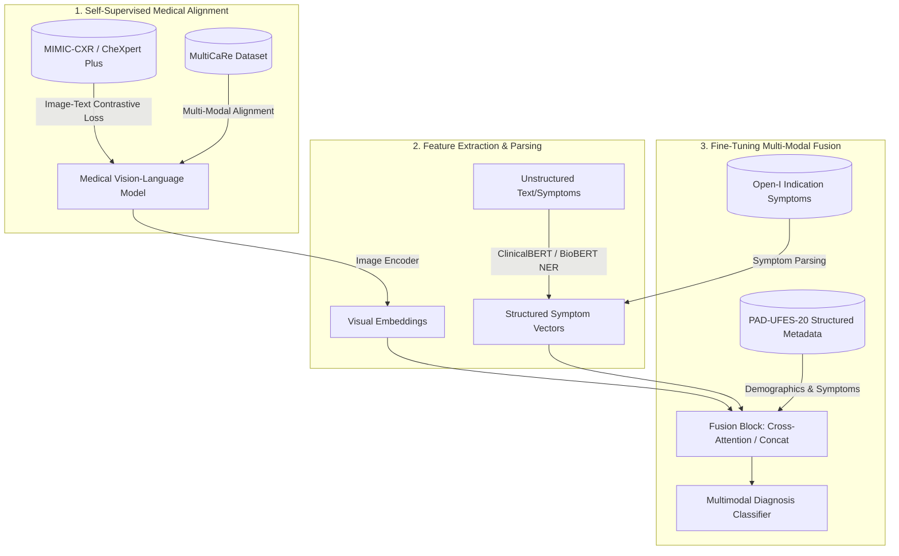

# Multimodal Datasets for Medical Diagnosis Assistant

This document provides a comparative analysis of the best open-source datasets for training a multimodal AI Medical Diagnosis Assistant. A truly multimodal medical assistant requires data that pairs **medical images** with **patient symptoms** (either in the form of unstructured clinical text, structured patient history, or clinical indications) and corresponding **disease labels**.

---

## 1. Dataset Comparison Matrix

| Dataset | Modality | Clinical Text / Symptoms | Primary Target Labels | Dataset Size | License | Commercial Use |
| :--- | :--- | :--- | :--- | :--- | :--- | :--- |
| **MIMIC-CXR / CheXpert Plus** | Chest Radiographs (X-rays) | Unstructured radiology reports (~36M tokens, demographics) | 14 thoracic findings (e.g., Cardiomegaly, Pneumonia) | ~377,110 images, 227,835 studies | PhysioNet Credentialed / Stanford Custom Research | **No** (Research Only) |
| **Open-I (IU Chest X-ray)** | Chest Radiographs (Frontal + Lateral) | XML reports (contains "Indication" field with symptoms) | Thoracic pathologies (extracted via MeSH terms/NLP) | 7,470 images, 3,955 reports | CC BY-NC-ND 4.0 | **No** (Research Only) |
| **PAD-UFES-20** | Clinical Dermatological Photos | 21-26 structured metadata fields (pain, itch, bleed, age, etc.) | 6 skin categories (3 benign, 3 cancers) | 2,298 images, 1,641 lesions | CC BY 4.0 | **Yes** |
| **MultiCaRe** | Multi-organ (CT, EKG, EEG, X-Ray, etc.) | Narrative case reports (symptoms, history, treatment) | ~140 categories spanning multiple specialties | 130,791 images, 93,816 case reports | CC BY-NC-SA 4.0 | **No** (Research Only) |

---

## 2. Deep-Dive Dataset Analysis

### A. MIMIC-CXR / CheXpert Plus (Stanford & MIT/BIDMC)

*   **Dataset Size:** 
    *   **MIMIC-CXR:** 377,110 chest radiographs paired with 227,835 unstructured free-text radiology reports from 64,588 patients. Raw files exceed 4 TB.
    *   **CheXpert Plus:** An aligned multimodal subset (~223,228 studies) that supplements the images with radiology reports (separated into sections like Findings/Impression), demographics (age, gender, race), and socio-economic data.
*   **License:** 
    *   *MIMIC-CXR:* PhysioNet Credentialed Health Data License (requires human subjects research training and credentialing).
    *   *CheXpert Plus:* Custom Stanford Research-Only License.
*   **Classes:**
    *   14 standard clinical observations: *Atelectasis, Cardiomegaly, Consolidation, Edema, Pleural Effusion, Pneumonia, Pneumothorax, Lung Lesion, Lung Opacity, Fracture, Pleural Other, Support Devices, No Finding, and Cardiomegaly*. Extended variants (e.g., MIMIC-CXR-LT) expand this to 26 or 45 long-tailed classes.
*   **Advantages:**
    *   **Scale:** Unmatched dataset size for vision-language clinical pre-training.
    *   **Uncertainty Coding:** CheXpert's labeling schema explicitly tags uncertain diagnoses (e.g., "-1.0" or "Uncertain"), which is highly representative of real-world clinical ambiguity.
    *   **Demographic Fairness:** CheXpert Plus contains rich metadata to audit and correct racial, gender, and socio-economic biases in diagnostic algorithms.
*   **Limitations:**
    *   **Commercial Barriers:** Restricted strictly to non-commercial research; credentialing is required.
    *   **Unstructured Symptoms:** Symptoms are not explicitly listed in a structured list. Instead, patient presentation is embedded within the narrative "Indication" and "Findings" sections of reports, requiring NLP pipelines to extract them.

---

### B. Indiana University Chest X-ray Collection (Open-I)

*   **Dataset Size:** 7,470 chest X-ray images (frontal/lateral) paired with 3,955 XML-formatted clinical reports.
*   **License:** CC BY-NC-ND 4.0 (Creative Commons Attribution-NonCommercial-NoDerivatives).
*   **Classes:** 
    *   No direct expert disease classification labels. Pathfinder terms (MeSH labels) are assigned automatically, but researchers typically parse reports using NLP toolkits (such as CheXbert or RadText) to extract thoracic diagnostic classes.
*   **Advantages:**
    *   **No Credentialing Barrier:** Accessible immediately compared to MIMIC-CXR.
    *   **Symptom Mapping:** XML reports feature a dedicated `<AbstractText Label="Indication">` field (e.g., *"Cough and chest pain for 3 days"*), which maps raw patient symptoms directly to imaging findings.
*   **Limitations:**
    *   **Small Scale:** At only 7.4k images, models trained exclusively on this dataset are highly prone to overfitting.
    *   **Skewed Distribution:** A large percentage of the reports are "normal," causing a high class imbalance for pathologies.

---

### C. PAD-UFES-20 (Federal University of Espírito Santo)

*   **Dataset Size:** 2,298 clinical smartphone images representing 1,641 skin lesions from 1,373 patients. 
*   **License:** CC BY 4.0 (Creative Commons Attribution - Commercial use allowed).
*   **Classes:** 
    *   6 categories: *Basal Cell Carcinoma (BCC), Squamous Cell Carcinoma (SCC), Melanoma (MEL), Actinic Keratosis (ACK), Melanocytic Nevus (NEV), Seborrheic Keratosis (SEK)*.
*   **Advantages:**
    *   **Commercial Use Permitted:** The CC BY 4.0 license is highly attractive for commercial deployment of healthcare MVPs.
    *   **Structured Symptoms:** Clinical metadata contains 21+ features, including direct patient-reported symptoms (e.g., `itch`, `grew`, `hurt`, `bleed`, `changed`) as boolean/categorical variables.
    *   **High Quality Labels:** 100% of cancer cases and 58% of overall lesions are biopsy-proven.
*   **Limitations:**
    *   **Domain-Specific:** Strictly limited to dermatology.
    *   **Modest Scale:** 2.2k images is too small for large models without extensive transfer learning.

---

### D. MultiCaRe (Multimodal Case Reports)

*   **Dataset Size:** 130,791 images associated with 93,816 clinical cases extracted from over 75,000 open-access PubMed Central articles.
*   **License:** CC BY-NC-SA 4.0 (Creative Commons Attribution-NonCommercial-ShareAlike).
*   **Classes:** 
    *   Over 140 clinical categories organized in a hierarchical taxonomy (representing oncology, cardiology, radiology, surgical cases, etc.).
*   **Advantages:**
    *   **Vast Modality Coverage:** Features CT scans, MRIs, EKGs, EEGs, ultrasound, and clinical photographs.
    *   **Narrative Clinical Cases:** Case texts include rich histories: initial symptom presentation, physical exams, imaging, treatments, and pathology.
    *   **Dedicated Tooling:** Provides a Python package and pre-trained medical classification embeddings.
*   **Limitations:**
    *   **Non-commercial:** Restricts downstream commercial products.
    *   **Bias Towards Rare Cases:** PubMed case reports inherently document unique, complex, or rare clinical anomalies, which do not reflect the standard epidemiological distributions of primary care clinics.

---

## 3. Recommended Dataset Combination Strategy

For a production-grade AI Medical Diagnosis Assistant, we recommend a **Hybrid Transfer Learning and Fine-Tuning Strategy** utilizing a combination of:
1. **MIMIC-CXR / CheXpert Plus + MultiCaRe** (for self-supervised pre-training and alignment)
2. **PAD-UFES-20 + Open-I** (for symptom-to-disease clinical diagnostics mapping)

### Why this combination?

1. **Leveraging Unmatched Scale:** Pre-training on MIMIC-CXR and MultiCaRe allows the model's visual and textual encoders to build a deep understanding of medical terminology, anatomy, and clinical language.
2. **Handling Unstructured vs. Structured Symptoms:** 
   - We extract unstructured symptoms from MIMIC-CXR and Open-I reports using a Named Entity Recognition (NER) pipeline (e.g., ClinicalBERT or MedSpacy) to convert raw clinical text into standard symptom codes (SNOMED-CT or ICD-10).
   - We inject PAD-UFES-20's structured symptom features (pain, itch, bleed) into the fusion layer to teach the classifier how to weight patient-reported symptoms alongside visual cues.
3. **Addressing Licensing constraints:**
   - For an **academic/research** assistant: The entire pipeline can be trained end-to-end.
   - For a **commercial** assistant: Use PAD-UFES-20 as the fine-tuning set, and swap MIMIC-CXR with open-access datasets (e.g., TCIA datasets or PMC-extracted images licensed under CC BY) for image-text pre-training.
